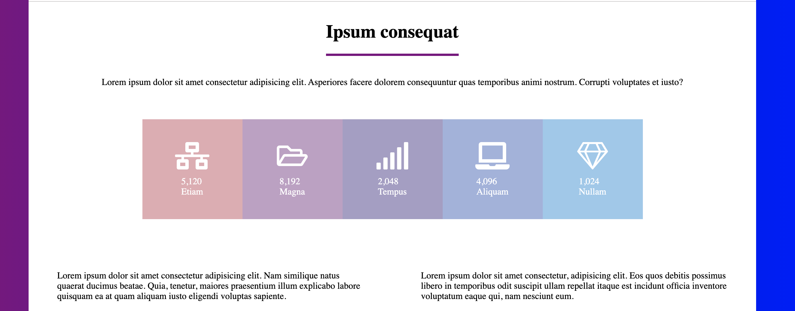

# Moon

[My LinkedIn](https://www.linkedin.com/in/samueltrahan/)

<br />

[](https://moon.samueltrahan.com)

# Description

Moon is a react application using different type of styling and can be used as a personal website or a business website.

# Screenshots


<br/>

<br />

<br />


# Using this template

#### 1. Clone this repository to your local machine.

```
git clone https://github.com/samueltrahan/moon.rt.git
```
#### 2. Navigate into the respository and install the node modules.

```
cd moon.rt
yarn
```


